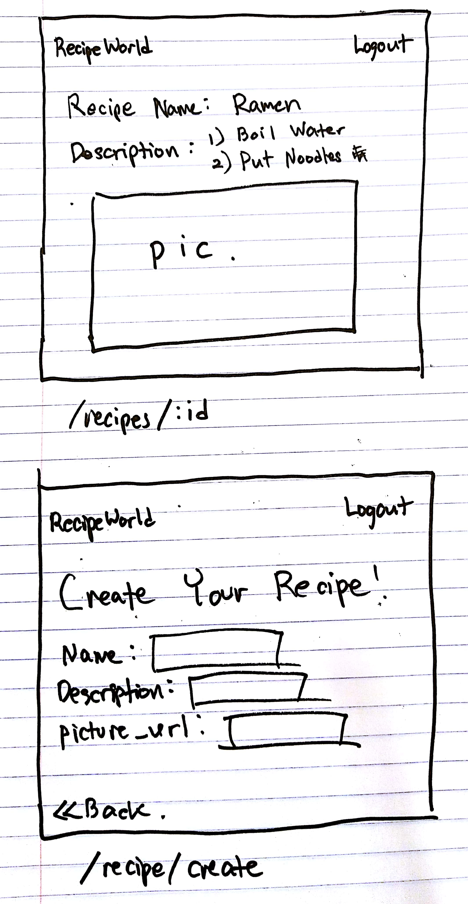
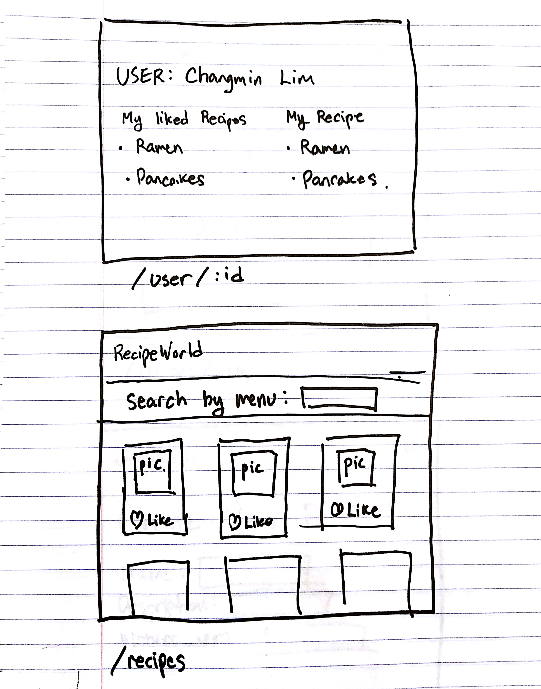
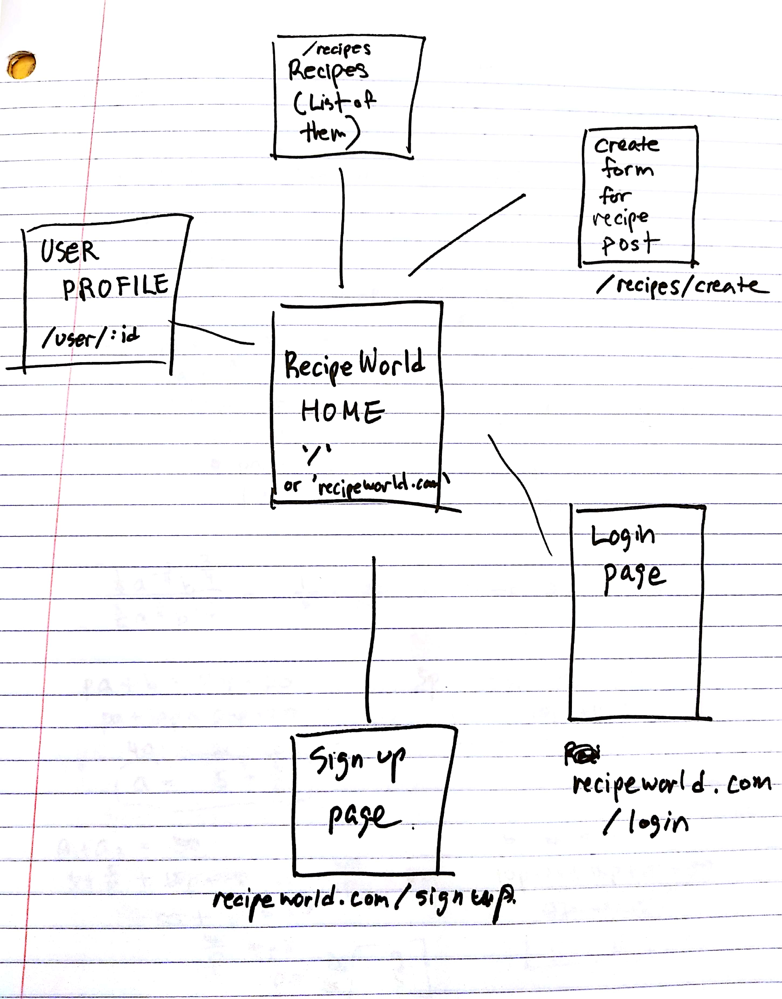

___TODO__:

# Recipe World (my first MERN Project)

## TO Compile and Run:
 1. Node server.js
 2. cd recipeFrontEnd & npm install
 3. npm start (in recipeFrontEnd directory)

 4. In any case you are having trouble with "node server.js" command, or if the database is empty, you can find example data in "dataseed.js". Simply uncomment them all, run "node dataseed.js", then repeat step 1~3.  


## Overview

Recipe World is where people share their own recipe along with pictures. You can explore other people's recipes and share your recipe by creating your own. All recipes will be rendered as a list of recipes in index page

## Data Model

The application will store Users, Recipes using mongoDB on mlab (https://docs.mlab.com/)

1. users can have multiple recipe posts
2. each post can have one User


An Example User:

```javascript
{
  name: "Chang",
  myRecipe: //an array of reference to Posts
}
```

An Example Recipe:

```javascript
{
  user: // a reference to a User object
  name: "Breakfast foods",
  descriptions (steps): "1. Wake up 2. Make breakfast
  picture_url: "https://www.wellplated.com/wp-content/uploads/2017/12/Hoppin-John-recipe-600x629.jpg"
}
```


## [Link to Commented First Draft Schema](db.js)

## Wireframes

 * pictures are in documentation folder *


/recipes/:id - page for each recipe based on id

/recipe/create - page for creating recipe post



/user/:id - page for user profile based on id

/recipes - page for showing list of recipe posts




## Site map




## User Stories or Use Cases

1. as non-registered user, I (Logged in as Chang) can create recipe post
2. I can view all of my recipe post in my profile
3. I can view all recipes created by other users

## Research Topics

* (2 points) Use a Semantic-ui & material-ui for CSS framework throughout your site

  * I tried to use both Semantic-ui and material-ui

* (3 points) Create a simple MERN project (MongoDB, Express.js, React, Node.js)

  * I tried to utilize all the frameworks we learned in class and connect them together.
  * This was the most time-consuming and could not add more functionality to my website due to lack of time.
  * Want to work on more functionality after finals.

* (2 points) Using React.js

  * I have previously learned React.js and want to use it to solidify the concepts.

## [Link to Initial Main Project File](app.js)

  * React initial set up is in the folder "recipeFrontEnd"

## Annotations / References Used

1. [tutorial on React](https://reactjs.org/docs/getting-started.html)
2. [tutorial on Heroku deploy](https://dev.to/smithmanny/deploy-your-react-app-to-heroku-2b6f)
3. [tutorial on mlab] (https://docs.mlab.com/)
4. [tutorial on material-ui] (https://material-ui.com/getting-started/usage/)
5. [tutorial on semantic-ui React] (https://react.semantic-ui.com/)
